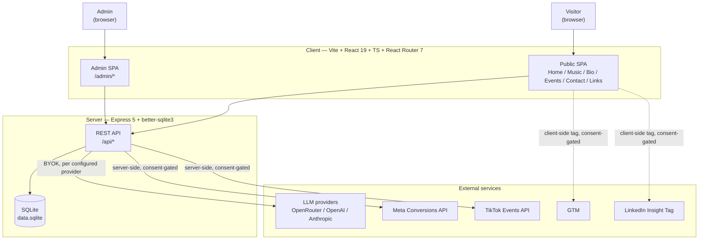
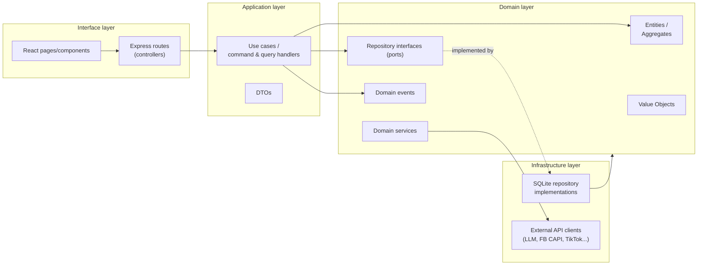

# bobprod backend architecture

This is the architecture spec for the **real bobprod site** (`Project/bobprod/` — Vite + React 19 +
Express 5 + better-sqlite3, per `project/uploads/CODING_AGENT_BRIEF.md`), not the Claude Design
HTML mockups in `project/*.dc.html`. Those mockups (App/Website/Biolink/Booking, now ported to
`project/app/`, `project/website/`, `project/biolink/`, `project/booking/`) define the **visual**
design; this folder defines the **domain and system architecture** behind it — Domain-Driven
Design (DDD) bounded contexts, the database schema, module specs, and the sequence flows that tie
them together, extended past the brief's Stage 1 to fully cover the modules the brief deferred to
Stage 2/3: Admin Settings, the Chat Assistant with BYOK LLM config, and Marketing/Tracking.

## How to read this folder

| Doc | Covers |
| --- | --- |
| [`domain-model.md`](./domain-model.md) | Bounded context map, aggregates/entities/value objects per context, full ER diagram |
| [`admin-settings.md`](./admin-settings.md) | The Admin module: site configuration, theme, SEO, content management |
| [`assistant-llm.md`](./assistant-llm.md) | The Chat Assistant module: visitor chat widget + admin-configurable multi-provider BYOK LLM |
| [`marketing.md`](./marketing.md) | Marketing & Tracking module: GTM/FB/TikTok/LinkedIn, consent, AI-assisted SEO |
| [`sequence-flows.md`](./sequence-flows.md) | End-to-end sequence diagrams for the key flows across modules |
| [`database-schema.md`](./database-schema.md) | Full SQLite DDL, grouped by bounded context |
| [`api-reference.md`](./api-reference.md) | Every REST endpoint, grouped by module, with auth requirements |

## System context

## Layered architecture (applies inside every bounded context)

**Rule of dependency**: arrows only point inward (interface → application → domain).
Infrastructure *implements* domain-owned interfaces (ports), it never gets imported by the domain
layer directly — this is what lets `better-sqlite3` or an LLM SDK be swapped later without
touching business logic. This matches (and formalizes) the brief's existing pattern of
`getSettings()`/`updateX()` helpers in `server/db.ts` — those become the infrastructure-layer
repository implementations behind an explicit port in this spec.

## Bounded contexts at a glance

See [`domain-model.md`](./domain-model.md) for the full context map. Short version:

- **Catalog** — tracks/mixes (existing Stage 1 `tracks` table)
- **Touring** — published events (existing Stage 1 `events` table)
- **Booking** — inbound booking requests (existing Stage 1 `bookings` table)
- **Links** — the `/links` biolink page (existing Stage 1 `biolinks` table)
- **Site Configuration** — theme, SEO defaults, general branding (Admin module)
- **Assistant** — chat widget + BYOK LLM provider config (new, this doc)
- **Marketing** — tracking pixels, consent, server-side conversions, AI SEO assist (new, this doc)
- **Identity** — the single admin account, session auth (existing Stage 1 `admin` table)

## Roadmap alignment

This spec **absorbs and completes** the brief's deferred stages:

| Brief stage | Status here |
| --- | --- |
| Stage 1 (tracks/events/bookings/biolinks CRUD) | Unchanged — see `domain-model.md` Catalog/Touring/Booking/Links contexts |
| Stage 2 (FB CAPI, TikTok Events, LinkedIn Insight, GTM, AI SEO) | Fully specified — see `marketing.md` |
| Stage 3 (multi-provider BYOK LLM chat) | Fully specified — see `assistant-llm.md` |
| "Polish" (EPK page, newsletter, analytics dashboard) | Out of scope here — not requested; flag before starting |

Auth providers (Google/Facebook OAuth for admin) remain **out of scope**, per the brief's own note
that it touches session/auth code and needs separate sign-off.
