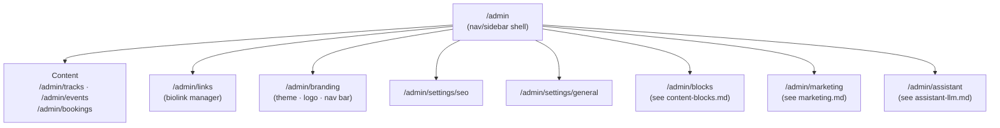

# Admin module — Settings &amp; Configuration

## Purpose

The Admin module is the back-office surface for the single admin account: content management
(tracks/events/bookings/biolinks — already scoped in Stage 1) plus site-wide configuration
(theme, SEO, branding). This doc covers the **configuration** half; content CRUD is already fully
specified in `project/uploads/CODING_AGENT_BRIEF.md` Stage 1 section 3 and isn't repeated here.

Every route below sits behind the existing `useAdminAuth` (frontend) / `requireAdmin` (backend)
gate — no new auth mechanism.

## Sub-modules



`Content` is Stage 1, unchanged. This doc details `Links`, `Branding` (theme/logo/nav), `Seo`, and
`General` — together they replace the brief's single, already-oversized `AdminSettings.tsx` with
the split the brief itself asks for ("split into separate admin pages... since there are now 6
admin sections"), now 8 with Links and Branding pulled out as their own pages.

## Domain recap

`SiteSettings` (singleton aggregate, `domain-model.md`):

```
SiteSettings
├── theme:      ThemeSettings      { accentRed, accentGold, bgColor }
├── branding:   BrandingSettings   { logoUrl?, logoAlt }
├── navigation: NavigationSettings { items: NavItem[] }
│                                    NavItem { id, label, route, isVisible, sortOrder }
├── seo:        SeoSettings        { defaultTitle, defaultDescription, perRouteOverrides }
└── general:    GeneralSettings    { siteName, timezone }
```

Each sub-object persists as its own row in the existing generic `settings` key-value table
(`theme`, `branding`, `navigation`, `seo`, `general` keys), exactly like the brief's existing
`seo`/`tracking`/`chatbot` keys — no schema migration needed beyond what Stage 1 already added.

`Biolink` (Links context, unchanged aggregate shape from `domain-model.md`) gains one field this
doc introduces: `isEnabled` — a link can be temporarily hidden from the public `/links` page
without deleting it (and losing its position/history). See "Links (biolink) management" below.

## Application layer (use cases)

| Use case | Trigger | Effect |
| --- | --- | --- |
| `GetSiteSettingsQuery` | `GET /api/admin/settings` (any sub-key) | Reads the current `SiteSettings` snapshot |
| `UpdateThemeCommand` | `PUT /api/admin/theme` | Validates hex colors, persists `theme` key |
| `UpdateSeoCommand` | `PUT /api/admin/settings/seo` | Persists `seo` key (default + per-route overrides) |
| `UpdateGeneralCommand` | `PUT /api/admin/settings/general` | Persists `general` key |
| `GetPublicConfigQuery` | `GET /api/public-config` (no auth) | Projects `theme` + `seo` (+ `tracking`/`chatbotEnabled` from Marketing/Assistant) into the single public-config payload `PublicConfigProvider` already fetches once on load |

These are the same shape as the brief's existing `getSettings()`/`updateSeo()` functions in
`server/db.ts` — this spec just names the pattern (command/query handler) so `theme`/`general`
follow it identically instead of ad hoc code per field.

## Frontend theme application

Unchanged from the brief: once `PublicConfigProvider` resolves, a `useEffect` in `App.tsx` (or
`Layout.tsx`) applies the theme via
`document.documentElement.style.setProperty('--accent-red', theme.accentRed)` etc., so an
admin-edited palette takes effect without a redeploy. **Known limitation, by design**: this is a
load-time read, not a live push — an admin who changes the theme while a visitor's tab is already
open doesn't update it until that visitor reloads. Adding a live-push (SSE/WebSocket) is explicitly
**out of scope** unless separately requested; it isn't needed for a single-admin, low-traffic site
and would add an always-on connection for no proportionate benefit.

## Logo upload (drag-and-drop)

`/admin/branding` includes a dropzone (drag a file in, or click to browse — same interaction
pattern as the brief's existing track/cover-art uploads) that replaces the default vinyl-mark SVG
wherever the logo renders (`Header.tsx`, `Footer.tsx`, and as the favicon source).

| Use case | Trigger | Effect |
| --- | --- | --- |
| `UploadLogoCommand` | `POST /api/admin/branding/logo` (multipart) | Validates file type (svg/png/webp) and a max size (e.g. 2 MB), stores it via the same `multer` + `server/uploads/` pattern the brief already uses for track/cover uploads, persists the resulting URL into the `branding` settings key |
| `RemoveLogoCommand` | `DELETE /api/admin/branding/logo` | Clears `logoUrl`, reverting to the default bundled mark — never a broken image |

`Logo.tsx` (the component the brief's file map already lists) is extended to render
`branding.logoUrl` when set, falling back to the existing inline SVG mark when it isn't — so a
fresh deployment with no uploaded logo still looks correct out of the box, matching the "template
to duplicate per client" model (a new client sees the default bobprod-style mark until they upload
their own).

## Navigation bar configuration

`NavigationSettings.items` seeds from the site's real routes (`/`, `/music`, `/bio`, `/events`,
`/contact`, `/links`) but is fully admin-editable:

- **Reorder** — drag-and-drop in the admin list, persisted as each item's `sortOrder`.
- **Show/hide** — `isVisible` toggle per item (e.g. hide `/links` from the main nav if it's only
  ever shared as a direct bio-link URL, without deleting the route itself).
- **Relabel** — `label` is editable text (e.g. rename "Music" to "Sets" without a code change).

`Header.tsx` renders the nav from `navigation.items` (filtered to `isVisible`, sorted by
`sortOrder`) via public config, instead of a hardcoded link list — the one behavior change this
introduces versus the brief's original `Header.tsx`.

| Use case | Trigger | Effect |
| --- | --- | --- |
| `UpdateNavigationCommand` | `PUT /api/admin/branding/navigation` | Validates each item still maps to a real route, persists `navigation` key |

## Links (biolink) management

`/admin/links` is the admin surface for the `Biolink` aggregate (`Links` context,
`domain-model.md`) — CRUD already exists at the API level in Stage 1; this is the UI/UX spec that
makes it pleasant to use day-to-day rather than raw form rows:

- **Platform icon picker** — a preset dropdown (Spotify, Apple Music, Deezer, Beatport,
  SoundCloud, YouTube, Instagram, "Custom") that sets the matching brand color + icon automatically,
  same visual set already built in `project/biolink/`; "Custom" reveals a plain label + URL pair
  for anything not in the preset list (a merch drop, a press article, a one-off link).
- **Drag-to-reorder** — updates `sort_order`, immediately reflected in the public `/links` page's
  order (same list the mockup renders).
- **Enable/disable per link** — the new `is_enabled` column lets an admin pull a link from public
  view (e.g. a sold-out ticket link) without losing its place in the list or re-entering it later.
- **Live preview pane** — the admin page embeds the actual public `/links` route in an iframe (or
  a shared React component instance) so edits are visible immediately, without a context switch to
  a separate browser tab.

| Use case | Trigger | Effect |
| --- | --- | --- |
| `ToggleBiolinkEnabledCommand` | `PUT /api/admin/biolinks/:id/enabled` | Flips `is_enabled`, no other field touched |

(`Create`/`Update`/`Delete`/reorder use cases are already covered by Stage 1's existing
`/api/admin/biolinks` routes — only the enable toggle is new.)

## SEO per-route overrides

`SeoSettings.perRouteOverrides` maps a route path (`/`, `/music`, `/bio`, `/events`, `/contact`,
`/links`) to an optional `{ title, description, ogImage }` override falling back to
`defaultTitle`/`defaultDescription` when absent. `SeoHead.tsx` (already built, per the brief's file
map) reads this per-route entry from public config via `react-helmet-async` — no change to that
component's contract, only to what populates it.

## API reference (this doc's scope only — see `api-reference.md` for the full table)

| Method | Path | Auth | Body / notes |
| --- | --- | --- | --- |
| `GET` | `/api/admin/settings` | admin | Returns `{ theme, branding, navigation, seo, general }` |
| `PUT` | `/api/admin/theme` | admin | `{ accentRed, accentGold, bgColor }` |
| `POST` | `/api/admin/branding/logo` | admin | Multipart file upload |
| `DELETE` | `/api/admin/branding/logo` | admin | Reverts to the default mark |
| `PUT` | `/api/admin/branding/navigation` | admin | `{ items: NavItem[] }` |
| `PUT` | `/api/admin/biolinks/:id/enabled` | admin | `{ isEnabled }` |
| `PUT` | `/api/admin/settings/seo` | admin | `{ defaultTitle, defaultDescription, perRouteOverrides }` |
| `PUT` | `/api/admin/settings/general` | admin | `{ siteName, timezone }` |
| `GET` | `/api/public-config` | none | Existing endpoint, extended with `theme`/`branding`/`navigation` |

## Verification checklist

- [ ] Changing accent colors in `/admin/theme` and reloading the public site shows the new colors
      (proves the public-config → CSS-var pipeline, not just that the admin form saves).
- [ ] Drag a logo file onto the branding dropzone → it appears in the header/footer on the public
      site; delete it → reverts cleanly to the default mark, no broken image.
- [ ] Reorder and hide a nav item → the public header reflects both changes; the hidden route is
      still reachable by direct URL (hiding from nav isn't the same as unpublishing).
- [ ] Reorder biolinks by drag-and-drop, disable one → `/links` reflects the new order and omits
      the disabled link, without losing its data (re-enabling restores it in the same position).
- [ ] A per-route SEO override on `/music` changes that route's `<title>`/meta description without
      affecting `/` or `/events`.
- [ ] Restarting the Express process preserves all settings and the uploaded logo file (proves
      SQLite + filesystem persistence, not in-memory state) — same check the brief already
      requires for tracks/events/bookings.
