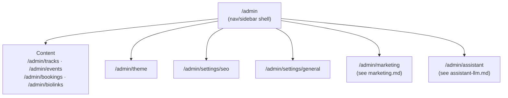

# Admin module — Settings &amp; Configuration

## Purpose

The Admin module is the back-office surface for the single admin account: content management
(tracks/events/bookings/biolinks — already scoped in Stage 1) plus site-wide configuration
(theme, SEO, branding). This doc covers the **configuration** half; content CRUD is already fully
specified in `project/uploads/CODING_AGENT_BRIEF.md` Stage 1 section 3 and isn't repeated here.

Every route below sits behind the existing `useAdminAuth` (frontend) / `requireAdmin` (backend)
gate — no new auth mechanism.

## Sub-modules



`Content` is Stage 1, unchanged. This doc details `Theme`, `Seo`, and `General` — together they
replace the brief's single, already-oversized `AdminSettings.tsx` with the split the brief itself
asks for ("split into separate admin pages... since there are now 6 admin sections").

## Domain recap

`SiteSettings` (singleton aggregate, `domain-model.md`):

```
SiteSettings
├── theme: ThemeSettings { accentRed, accentGold, bgColor }
├── seo:   SeoSettings   { defaultTitle, defaultDescription, perRouteOverrides }
└── general: GeneralSettings { siteName, timezone }
```

Each sub-object persists as its own row in the existing generic `settings` key-value table
(`theme`, `seo`, `general` keys), exactly like the brief's existing `seo`/`tracking`/`chatbot` keys
— no schema migration needed beyond what Stage 1 already added.

## Application layer (use cases)

| Use case | Trigger | Effect |
| --- | --- | --- |
| `GetSiteSettingsQuery` | `GET /api/admin/settings` (any sub-key) | Reads the current `SiteSettings` snapshot |
| `UpdateThemeCommand` | `PUT /api/admin/theme` | Validates hex colors, persists `theme` key |
| `UpdateSeoCommand` | `PUT /api/admin/settings/seo` | Persists `seo` key (default + per-route overrides) |
| `UpdateGeneralCommand` | `PUT /api/admin/settings/general` | Persists `general` key |
| `GetPublicConfigQuery` | `GET /api/public-config` (no auth) | Projects `theme` + `seo` (+ `tracking`/`chatbotEnabled` from Marketing/Assistant) into the single public-config payload `PublicConfigProvider` already fetches once on load |

These are the same shape as the brief's existing `getSettings()`/`updateSeo()` functions in
`server/db.ts` — this spec just names the pattern (command/query handler) so `theme`/`general`
follow it identically instead of ad hoc code per field.

## Frontend theme application

Unchanged from the brief: once `PublicConfigProvider` resolves, a `useEffect` in `App.tsx` (or
`Layout.tsx`) applies the theme via
`document.documentElement.style.setProperty('--accent-red', theme.accentRed)` etc., so an
admin-edited palette takes effect without a redeploy. **Known limitation, by design**: this is a
load-time read, not a live push — an admin who changes the theme while a visitor's tab is already
open doesn't update it until that visitor reloads. Adding a live-push (SSE/WebSocket) is explicitly
**out of scope** unless separately requested; it isn't needed for a single-admin, low-traffic site
and would add an always-on connection for no proportionate benefit.

## SEO per-route overrides

`SeoSettings.perRouteOverrides` maps a route path (`/`, `/music`, `/bio`, `/events`, `/contact`,
`/links`) to an optional `{ title, description, ogImage }` override falling back to
`defaultTitle`/`defaultDescription` when absent. `SeoHead.tsx` (already built, per the brief's file
map) reads this per-route entry from public config via `react-helmet-async` — no change to that
component's contract, only to what populates it.

## API reference (this doc's scope only — see `api-reference.md` for the full table)

| Method | Path | Auth | Body / notes |
| --- | --- | --- | --- |
| `GET` | `/api/admin/settings` | admin | Returns `{ theme, seo, general }` |
| `PUT` | `/api/admin/theme` | admin | `{ accentRed, accentGold, bgColor }` |
| `PUT` | `/api/admin/settings/seo` | admin | `{ defaultTitle, defaultDescription, perRouteOverrides }` |
| `PUT` | `/api/admin/settings/general` | admin | `{ siteName, timezone }` |
| `GET` | `/api/public-config` | none | Existing endpoint, extended with `theme` (already listed in the brief) |

## Verification checklist

- [ ] Changing accent colors in `/admin/theme` and reloading the public site shows the new colors
      (proves the public-config → CSS-var pipeline, not just that the admin form saves).
- [ ] A per-route SEO override on `/music` changes that route's `<title>`/meta description without
      affecting `/` or `/events`.
- [ ] Restarting the Express process preserves all three settings (proves SQLite persistence, not
      in-memory state) — same check the brief already requires for tracks/events/bookings.
