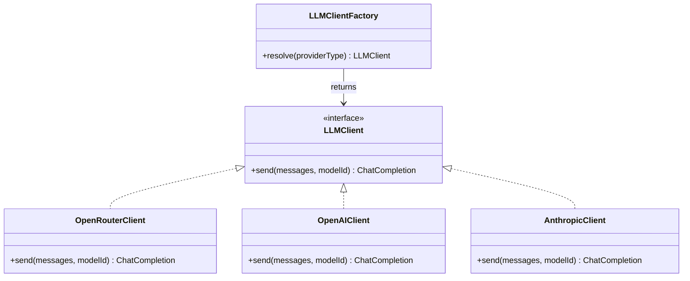

# Assistant module — Chat widget &amp; BYOK LLM configuration

## Purpose

Two halves of one context: the visitor-facing `ChatWidget` (already built, per the brief's file
map — currently hardwired to a single provider) and the admin-configurable **multi-provider BYOK**
LLM backend the brief scopes as Stage 3: *"multi-provider BYOK LLM settings, OpenRouter as the
universal option covering DeepSeek/Gemini/Kimi/etc., plus direct OpenAI/Anthropic"*, extending the
existing single-provider chatbot config.

## Domain recap

- **`LLMProviderConfig`** aggregate — one row per configured provider/key pair. Admin can add
  several (e.g. an OpenRouter key *and* a direct Anthropic key) but exactly one is `isDefault`.
- **`ChatConversation`** aggregate — one per visitor session, holding an ordered list of
  `ChatMessage` entities. Each message snapshots the `providerId` that answered it, so conversation
  history stays accurate even after the admin changes the default provider later.

## Provider strategy

One interface (`LLMClient`), one adapter per `providerType`. `OpenRouterClient` is what makes
DeepSeek/Gemini/Kimi/etc. "just work" without a dedicated adapter each — OpenRouter's API is
OpenAI-compatible, so `OpenRouterClient` and `OpenAIClient` can in practice share almost all of
their implementation (base URL + auth header are the only differences); `AnthropicClient` is the
one adapter with a genuinely different request/response shape (Messages API).

Adding a fifth provider later means writing one adapter class and registering it in
`LLMClientFactory` — nothing else in the domain or application layer changes. This is the concrete
payoff of the port/adapter split from the layered-architecture diagram in `README.md`.

## Application layer (use cases)

| Use case | Trigger | Effect |
| --- | --- | --- |
| `SendChatMessageCommand` | `POST /api/chat` (public) | Resolves the default active `LLMProviderConfig`, calls it via `LLMClientFactory`, appends both the visitor and assistant `ChatMessage`s to the (possibly new) `ChatConversation`, returns the reply |
| `ListProviderConfigsQuery` | `GET /api/admin/assistant/providers` | Lists configs with the API key **masked** (`sk-••••1234`), never the plaintext |
| `AddProviderConfigCommand` | `POST /api/admin/assistant/providers` | Validates `providerType`/`modelId`, encrypts the key at rest, persists |
| `UpdateProviderConfigCommand` | `PUT /api/admin/assistant/providers/:id` | Same validation; re-encrypts only if a new key was submitted (an empty key field means "keep the existing one" — never round-trips the decrypted key to the admin UI to be resubmitted) |
| `DeleteProviderConfigCommand` | `DELETE /api/admin/assistant/providers/:id` | Refuses to delete the last remaining `isDefault` config without another one to promote first |
| `SetDefaultProviderCommand` | `PUT /api/admin/assistant/providers/:id/default` | Atomically flips `isDefault` off the previous holder and onto this one (single transaction — never zero or two defaults at once) |
| `ToggleChatbotEnabledCommand` | `PUT /api/admin/settings/chatbot` | Existing Stage 1 toggle, unchanged — gates whether `ChatWidget` renders at all via `chatbotEnabled` in public config |
| `TestProviderConnectionCommand` | `POST /api/admin/assistant/providers/:id/test` | Sends a minimal "ping" completion request; returns latency + success/failure so the admin isn't debugging a bad key via the live chat widget |

## Security

- **API keys are encrypted at rest** (AES-256-GCM, key material from an environment secret
  distinct from `JWT_SECRET`) — the `encrypted_api_key` column never holds plaintext, matching the
  same trust boundary the brief already applies to `ADMIN_PASSWORD`/bcrypt.
- **Keys never round-trip to the browser.** `ListProviderConfigsQuery` returns a masked
  suffix only; the "edit" form's key field starts empty, and submitting it empty means "no
  change" — the only way to change a key is to type a new one.
- **Rate limiting on `/api/chat`** (already flagged in the brief's "critical gaps" — this module
  is exactly why it matters: an unthrottled chat endpoint against a BYOK key is a direct path to a
  surprise bill). Use `express-rate-limit`, keyed by IP + visitor session.
- **System prompt is admin-configurable but server-side only** — never sent to or editable from
  the public chat widget, to prevent prompt-injection from a visitor rewriting the assistant's
  instructions via the client.

## Sequence: visitor sends a chat message

See `sequence-flows.md` for the full diagram; summary: `ChatWidget` → `POST /api/chat` →
rate-limit check → `SendChatMessageCommand` → `LLMClientFactory.resolve(defaultConfig.providerType)`
→ provider API → append messages to `ChatConversation` → response back to widget. If
`chatbotEnabled` is false or no `LLMProviderConfig` has `isDefault = true`, the widget doesn't
render at all (checked client-side from public config) and the endpoint itself 404s server-side as
a defense-in-depth measure.

## Admin UI (`/admin/assistant`)

- Provider list: label, type, model, masked key, active/default badges, per-row **Test connection**
  and delete.
- Add/edit form: provider type select → conditionally shows the right fields (model id free-text
  for OpenRouter since its model catalog changes frequently; a fixed dropdown for OpenAI/Anthropic
  is a reasonable later refinement, not required for Stage 3).
- System prompt editor (single shared prompt across providers — per-provider prompts are
  unnecessary complexity for a single chat widget).
- The existing Stage 1 chatbot enable/disable toggle relocates here from the general Settings page
  (it's conceptually part of this module now, not general site config).

## API reference (this module's scope — see `api-reference.md` for the full table)

| Method | Path | Auth | Notes |
| --- | --- | --- | --- |
| `POST` | `/api/chat` | none (public, rate-limited) | `{ message, sessionId }` → `{ reply }` |
| `GET` | `/api/admin/assistant/providers` | admin | Keys masked |
| `POST` | `/api/admin/assistant/providers` | admin | |
| `PUT` | `/api/admin/assistant/providers/:id` | admin | |
| `DELETE` | `/api/admin/assistant/providers/:id` | admin | |
| `PUT` | `/api/admin/assistant/providers/:id/default` | admin | |
| `POST` | `/api/admin/assistant/providers/:id/test` | admin | |
| `PUT` | `/api/admin/settings/chatbot` | admin | Existing Stage 1 endpoint, relocated UI only |

## Verification checklist

- [ ] Configure an OpenRouter key + model, mark default, send a chat message from the public
      widget, see a real reply.
- [ ] Add a second (Anthropic) config, switch the default, confirm new messages answer from the
      new provider while old messages in the same conversation still show their original
      `providerId` in an admin-only conversation viewer (if built) or DB inspection.
- [ ] Delete a non-default config — succeeds. Attempt to delete the only/default config — rejected
      with a clear error, not a silent no-default state.
- [ ] Hammer `/api/chat` past the rate limit — confirm 429s, per the brief's existing requirement.
- [ ] Confirm the admin "list providers" response never contains a full API key, only a masked
      suffix, via an actual network inspector — not just code review.
