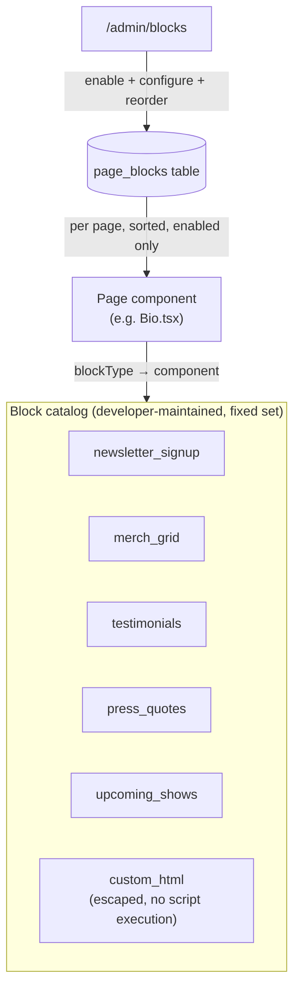
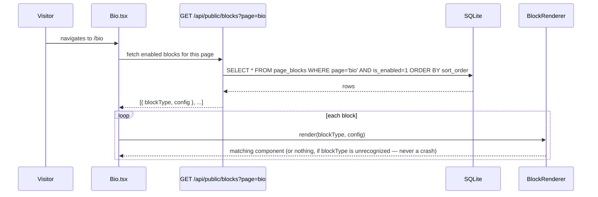

# Content Blocks module — activatable, admin-configurable page sections

## Purpose

The "extensibility, like WordPress" piece — **scoped to activatable blocks**, not a third-party
plugin API. WordPress's *plugin* model runs arbitrary uploaded PHP with full server access; that's
disproportionate for a single-admin, template-per-client site, and introduces a real security
surface (arbitrary code execution) with no one asking to build or install third-party code here.

What WordPress's block editor (Gutenberg) gets right, and what this module actually copies: a
**fixed, developer-maintained catalog** of block types, each independently **enabled, configured,
and ordered** by the admin, per page, without a redeploy. New block types still require a developer
to build and review them (same trust boundary as the rest of this codebase) — what the admin gets
is control over *arrangement and content*, not code execution.

## Domain model

- **Aggregate root: `PageBlock`**
  — `id`, `page` (VO enum: `home | bio | music | events | contact | links`), `blockType` (VO enum,
  see catalog below), `isEnabled`, `sortOrder`, `config` (JSON, shape defined per `blockType`).
- Invariant: `sortOrder` is scoped per `page` — reordering blocks on `/bio` never touches
  `/home`'s ordering.
- No sub-entities — a block instance is a single-entity aggregate, same shape as `Track`/`Event`.

## Why `custom_html` doesn't reopen the code-execution door

`custom_html` is the one block type that looks like an escape hatch — it isn't one. Its `config`
is sanitized (stripped of `<script>`, inline event handlers, `<iframe>` to non-allowlisted origins)
before storage and again before render, the same way any user-submitted rich text would be treated
at a trust boundary. It's meant for a paragraph of formatted copy or an embed from an allowlisted
provider (e.g. a YouTube URL turned into a safe embed server-side), not arbitrary markup.

## Initial block catalog

| `blockType` | Renders | `config` shape |
| --- | --- | --- |
| `newsletter_signup` | Email capture form (the Biolink page's existing capture, generalized) | `{ headline, buttonLabel, listProviderId }` — `listProviderId` references a future email-list provider config (out of scope here; today it can point at a `mailto:` fallback or a webhook URL) |
| `merch_grid` | A subset or all of the Catalog's products | `{ productIds: number[] \| "all" }` |
| `testimonials` | Quote cards | `{ quotes: { text, attribution }[] }` |
| `press_quotes` | Press-mention strip (logos + pull-quotes) | `{ items: { outlet, quote, logoUrl }[] }` |
| `upcoming_shows` | The next *n* published events | `{ limit }` |
| `custom_html` | Sanitized rich text/embed | `{ html }` (sanitized, see above) |

Adding a seventh block type is a normal, reviewed code change (one React component + one config
shape + one catalog registration) — not a runtime plugin install. That distinction is the entire
point of the "blocks, not plugins" scope decision.

## Application layer (use cases)

| Use case | Trigger | Effect |
| --- | --- | --- |
| `ListPageBlocksQuery` | `GET /api/admin/blocks?page=bio` | Lists all blocks (enabled or not) for a page, in `sortOrder` |
| `AddPageBlockCommand` | `POST /api/admin/blocks` | `{ page, blockType }` — creates a disabled block instance with an empty/default `config`, ready to configure |
| `UpdatePageBlockConfigCommand` | `PUT /api/admin/blocks/:id` | Validates `config` against the shape for that block's `blockType` |
| `ToggleBlockEnabledCommand` | `PUT /api/admin/blocks/:id/enabled` | Flips `isEnabled` |
| `ReorderPageBlocksCommand` | `PUT /api/admin/blocks/reorder` | `{ page, orderedIds: number[] }` — rewrites `sortOrder` for that page in one transaction |
| `GetPublicPageBlocksQuery` | Part of each public page's existing data fetch (e.g. folded into `GET /api/public/bio` if that route exists, or a dedicated `GET /api/public/blocks?page=bio`) | Returns only `isEnabled = true` blocks, sorted |

## Rendering sequence

An unrecognized `blockType` (e.g. a block added by a newer app version, then the DB is opened by
an older deployed build) renders nothing for that one block rather than throwing — the same
defensive-rendering principle as the brief's own error-boundary requirement, applied at the block
level instead of the page level.

## Admin UI (`/admin/blocks`)

- Per-page tab (Home / Bio / Music / Events / Contact / Links) showing that page's block list.
- "Add block" opens the catalog (name + one-line description + a small preview thumbnail per
  type), inserts it disabled at the end of the list.
- Each row: enable toggle, drag handle (reorder), "Configure" (opens the type-specific form),
  delete.
- Same live-preview-pane pattern as `admin-settings.md`'s Links manager — the actual public page
  renders alongside the block list so arrangement changes are visible immediately.

## API reference (this module's scope — see `api-reference.md` for the full table)

| Method | Path | Auth | Notes |
| --- | --- | --- | --- |
| `GET` | `/api/admin/blocks` | admin | `?page=` filter |
| `POST` | `/api/admin/blocks` | admin | |
| `PUT` | `/api/admin/blocks/:id` | admin | Config update, validated per `blockType` |
| `PUT` | `/api/admin/blocks/:id/enabled` | admin | |
| `PUT` | `/api/admin/blocks/reorder` | admin | |
| `GET` | `/api/public/blocks` | none | `?page=` filter, enabled only |

## Verification checklist

- [ ] Add a `testimonials` block to `/bio`, configure two quotes, enable it — appears on the
      public bio page in the right position.
- [ ] Reorder blocks on `/home` — public page reflects new order; `/bio`'s block order is
      untouched (proves per-page `sortOrder` scoping).
- [ ] Disable a block — disappears from the public page but its configuration is retained when
      re-enabled (not deleted).
- [ ] Submit a `custom_html` block containing a `<script>` tag — confirm it's stripped before
      storage (inspect the DB row) and again would be stripped on render even if it somehow got
      stored, i.e. sanitization isn't a single point of failure.
- [ ] Manually insert a row with an unknown `block_type` directly in SQLite — confirm the public
      page still renders everything else without crashing.
