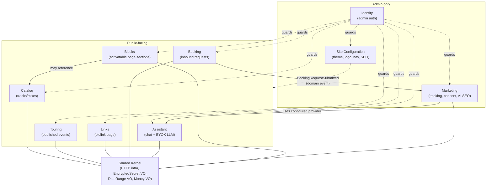
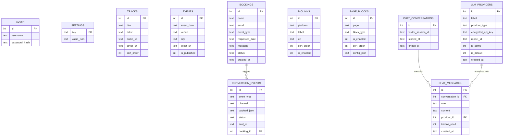

# Domain model

## Bounded context map

`Blocks` is the "activatable sections, WordPress-block-style" extensibility context — see
`content-blocks.md`. Its one cross-context reference is intentionally read-only: a `merch_grid`
block *reads* Catalog product data to render, it never writes to Catalog and Catalog has no
awareness Blocks exists — same one-directional-dependency discipline as the Marketing→Assistant
relationship below.

Two dependencies are worth calling out because they're the ones that would otherwise tempt a
shortcut:

- **Marketing → Assistant**: the "AI-assisted SEO generation" feature (`marketing.md`) needs an
  LLM call. It goes through the **same** `LLMClient` port the Assistant context owns, rather than
  Marketing rolling its own provider config — one BYOK config, one place to rotate a key.
- **Booking → Marketing**: decoupled via a **domain event**
  (`BookingRequestSubmitted`), not a direct call. Booking's use case doesn't know Marketing exists;
  an event listener in Marketing reacts to send the FB/TikTok conversion events. This is the one
  place in the system where an in-process domain event bus earns its keep — everywhere else,
  direct application-service calls are simpler and fine.

## Context responsibilities

| Context | Owns | Does not own |
| --- | --- | --- |
| Catalog | Track metadata, sort order, audio/cover URLs | Playback UI (that's `PlaylistPlayer.tsx`) |
| Touring | Published events, publish/unpublish state | Booking requests (separate aggregate — a request is a *lead*, not yet a published date) |
| Booking | Inbound booking requests + status workflow | Sending marketing conversion events (listens via domain event instead) |
| Links | The ordered biolink list | Platform icon assets (frontend concern) |
| Identity | Single admin credential, session issuance | Any per-user roles/permissions (out of scope — one admin account by design) |
| Site Configuration | Theme tokens, logo, nav bar layout, SEO defaults per route, general branding | Tracking IDs (Marketing owns those) |
| Assistant | LLM provider configs (BYOK), chat conversations | Marketing's use of the LLM (Marketing calls through Assistant's port) |
| Marketing | Tracking config per channel, consent policy, conversion event log | The LLM client itself (borrows Assistant's) |
| Blocks | Which page sections are enabled, their config and order | The block *types themselves* — a fixed, developer-maintained catalog, not admin-authored code |

## Aggregates, entities & value objects

### Catalog

- **Aggregate root: `Track`**
  — `id`, `title`, `artist` (defaults `"bobprod"`), `audioUrl` (VO: `MediaUrl`), `coverUrl?`
  (VO: `MediaUrl`), `sortOrder`.
- No sub-entities; a track is single-entity aggregate, matches Stage 1 `tracks` table 1:1.

### Touring

- **Aggregate root: `Event`**
  — `id`, `eventDate` (VO: `CalendarDate`), `venue`, `city?`, `ticketUrl?`, `isPublished`.
- Invariant: an unpublished event never appears in `GET /api/public/events`.

### Booking

- **Aggregate root: `BookingRequest`**
  — `id`, `contact` (VO: `Contact { name, email }`), `eventType?`, `requestedDate?`
  (VO: `CalendarDate`), `message?`, `status` (VO: `BookingStatus` enum
  `pending | confirmed | declined`), `createdAt`.
- Domain event: **`BookingRequestSubmitted`** — raised once, on creation, carrying the same fields
  Marketing needs for a "Lead" conversion event (name/email intentionally *not* included in the
  event payload sent externally — see `marketing.md`'s PII note).
- Invariant: status transitions are `pending → confirmed` or `pending → declined` only (no
  reopening a decided request — create a new one instead).

### Links

- **Aggregate root: `Biolink`**
  — `id`, `platform`, `label`, `url` (VO: `ExternalUrl`), `sortOrder`, `isEnabled`.

### Identity

- **Aggregate root: `AdminAccount`**
  — `id`, `username`, `passwordHash` (VO: `HashedPassword`, bcrypt).
- Single row by design (one admin account per deployment, per the brief's "every artist gets their
  own deployment" model) — no `Role`/`Permission` entities; adding multi-user auth is a separate,
  explicitly-scoped change (per the brief's own deferred "auth providers" note).

### Site Configuration

- **Aggregate root: `SiteSettings`** (singleton row, same key-value pattern as Stage 1's
  `settings` table)
  — `theme` (VO: `ThemeSettings { accentRed, accentGold, bgColor }`),
  `branding` (VO: `BrandingSettings { logoUrl?, logoAlt }`),
  `navigation` (VO: `NavigationSettings { items: NavItem[] }` where
  `NavItem { id, label, route, isVisible, sortOrder }`),
  `seo` (VO: `SeoSettings { defaultTitle, defaultDescription, perRouteOverrides: Map<Route, SeoEntry> }`),
  `general` (VO: `GeneralSettings { siteName, timezone }`).

### Assistant

- **Aggregate root: `LLMProviderConfig`**
  — `id`, `providerType` (VO enum: `openrouter | openai | anthropic | custom`), `label`,
  `apiKey` (VO: `EncryptedSecret` — never leaves the server decrypted), `modelId`, `isActive`,
  `isDefault`.
  Invariant: at most one config has `isDefault = true`; enforced in the aggregate, not just the DB.
- **Aggregate root: `ChatConversation`**
  — `id`, `visitorSessionId`, `startedAt`, `endedAt?`, entity list `messages: ChatMessage[]`
  (`id`, `role` (VO enum `user | assistant`), `content`, `providerId` (snapshot — which config
  answered, even if the admin changes the default later), `tokensUsed?`, `createdAt`).

### Marketing

- **Aggregate root: `TrackingConfig`** (singleton, one per deployment)
  — `gtm` (VO: `GtmConfig { containerId }`), `facebook` (VO: `FacebookConfig { pixelId, capiToken }`),
  `tiktok` (VO: `TiktokConfig { pixelId, eventsApiToken }`),
  `linkedin` (VO: `LinkedinConfig { insightTagId }`), `consentPolicy` (VO: `ConsentPolicy`
  listing the categories the `ConsentBanner`/`useConsent` context already enforces:
  `necessary | analytics | marketing`).
- **Entity: `ConversionEventLogEntry`** (append-only, owned by `TrackingConfig` aggregate for
  write purposes but queried independently for the admin audit view)
  — `id`, `eventType` (e.g. `Lead`), `channel` (VO enum `facebook_capi | tiktok_events`),
  `payloadJson`, `status` (VO enum `sent | failed`), `sentAt`.

### Blocks

- **Aggregate root: `PageBlock`**
  — `id`, `page` (VO enum: `home | bio | music | events | contact | links`), `blockType` (VO
  enum, fixed catalog — see `content-blocks.md`), `isEnabled`, `sortOrder` (scoped per `page`),
  `config` (JSON, shape defined per `blockType`).

## Entity-relationship diagram

`SETTINGS` stays the generic key-value table from Stage 1 (now also carrying `branding` and
`navigation` keys alongside `theme`/`seo`/`tracking`/`chatbot`, each a JSON blob) —
`LLM_PROVIDERS`, `CHAT_CONVERSATIONS`, `CHAT_MESSAGES`, `CONVERSION_EVENTS` and `PAGE_BLOCKS` are
genuinely relational (multiple rows per concept, queried/filtered/ordered independently) so they
get real tables instead of another blob. See `database-schema.md` for full DDL.
