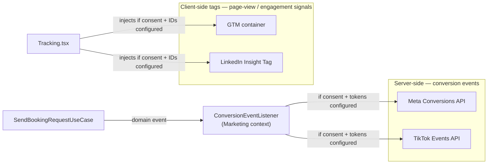
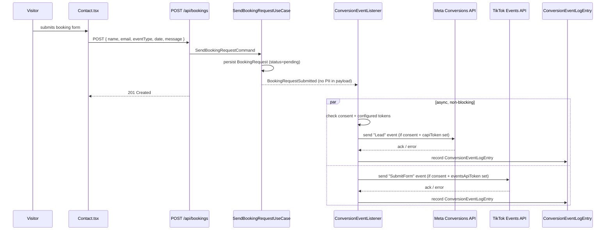

# Marketing module — Tracking, consent &amp; AI-assisted SEO

## Purpose

Everything the brief scopes as Stage 2 — *"Facebook Conversions API (direct server-side, not via
Stape/AWS), TikTok Events API, LinkedIn Insight Tag, Google Ads/GA4 via existing GTM, AI-assisted
SEO generation button in admin"* — plus the consent gating that already exists in the frontend
(`ConsentBanner.tsx`, `useConsent.ts`) and must stay wired to every channel below, not just GTM.

## Domain recap

`TrackingConfig` (singleton aggregate, `domain-model.md`):

```
TrackingConfig
├── gtm:      GtmConfig      { containerId }
├── facebook: FacebookConfig { pixelId, capiToken }
├── tiktok:   TiktokConfig   { pixelId, eventsApiToken }
├── linkedin: LinkedinConfig { insightTagId }
└── consentPolicy: ConsentPolicy { necessary, analytics, marketing }
```

Persists under the existing `tracking` key in the `settings` table (Stage 1 already has this key
for GTM/pixel IDs — this doc adds the CAPI/Events-API tokens and the LinkedIn tag to the same
blob, no new table needed for config itself).

`ConversionEventLogEntry` is the one genuinely relational addition here — an append-only audit
trail of every server-side conversion call, so a failed FB CAPI call is *visible* somewhere instead
of silently vanishing into a server log nobody checks.

## Client-side vs. server-side, and why both exist



- **Client-side** (GTM, LinkedIn Insight Tag): page-view and generic engagement tracking, injected
  by the existing `Tracking.tsx` component, already gated on `useConsent()` per the brief's
  known-bug note (shared `ConsentProvider` context, never per-component state).
- **Server-side** (FB Conversions API, TikTok Events API): the high-value **conversion** event —
  a submitted booking request — sent directly from the Express server, per the brief's explicit
  instruction ("direct server-side, not via Stape/AWS"). This is more reliable than client-side
  pixels alone (survives ad blockers, doesn't depend on the visitor's tab staying open) and is the
  standard modern pattern for both Meta and TikTok.

## Domain event flow: booking → conversion

`BookingRequestSubmitted` (raised by the Booking context, `domain-model.md`) carries only
non-identifying fields for the conversion payload — **no name or email** goes into the FB/TikTok
event body; both APIs accept a *hashed* identifier (SHA-256 of a normalized email) if
identity-matching is wanted later, which is a deliberate future decision, not a default. Shipping
the visitor's raw email to a third-party ad platform without an explicit, separately-reviewed
decision to do so is not something this spec bakes in silently.



The `Api → ContactPage` response does **not** wait on the conversion sends — they're fired after
the booking is already persisted and acknowledged, so a slow or failing third-party API never
delays or breaks the visitor-facing booking flow. A failed send is logged, not retried
indefinitely (a manual "resend" action from the admin audit view is a reasonable later addition,
not required for Stage 2).

## AI-assisted SEO generation

Reuses the Assistant context's `LLMClient` (see `assistant-llm.md`) rather than introducing a
second LLM integration:

| Use case | Trigger | Effect |
| --- | --- | --- |
| `GenerateSeoCopyCommand` | Admin clicks "Generate" next to a route in `/admin/settings/seo` | Calls the default `LLMProviderConfig` via `LLMClientFactory` with a fixed system prompt ("write a concise SEO title + meta description for this page, given: {route, existing site copy}") → returns a **draft** the admin reviews and edits before saving |

Human-in-the-loop by design: the generated copy is never auto-published — it fills the SEO form
fields for the admin to accept, edit, or discard, same as any other form field in
`admin-settings.md`. This also means the feature is inert (button hidden or disabled) whenever no
`LLMProviderConfig` is configured yet, rather than erroring.

## Application layer (use cases)

| Use case | Trigger | Effect |
| --- | --- | --- |
| `GetTrackingConfigQuery` | `GET /api/admin/marketing` | Returns current `TrackingConfig` (tokens masked, same pattern as `assistant-llm.md`'s provider keys) |
| `UpdateTrackingConfigCommand` | `PUT /api/admin/marketing` | Validates IDs/tokens, persists `tracking` key |
| `ListConversionEventsQuery` | `GET /api/admin/marketing/events` | Paginated audit log for the admin view |
| `GenerateSeoCopyCommand` | `POST /api/admin/marketing/seo-suggest` | See above |

## API reference (this module's scope — see `api-reference.md` for the full table)

| Method | Path | Auth | Notes |
| --- | --- | --- | --- |
| `GET` | `/api/admin/marketing` | admin | Tokens masked |
| `PUT` | `/api/admin/marketing` | admin | `{ gtm, facebook, tiktok, linkedin, consentPolicy }` |
| `GET` | `/api/admin/marketing/events` | admin | Conversion send audit log |
| `POST` | `/api/admin/marketing/seo-suggest` | admin | `{ route }` → `{ title, description }` draft |
| `GET` | `/api/public-config` | none | Extended (already in the brief) to expose only the **public** tag IDs (GTM container, LinkedIn tag) — CAPI/Events-API tokens never appear here, they're server-only |

## Verification checklist

- [ ] With consent declined, confirm no GTM/LinkedIn tag fires and no FB/TikTok server call is
      made on a test booking submission (check the audit log stays empty).
- [ ] With consent granted and tokens configured, submit a test booking → see a `sent` entry in
      the conversion audit log, and confirm (via the provider's own test-event tool) the event
      arrived — this is the one check that needs an actual FB/TikTok test account, not just this
      codebase.
- [ ] Temporarily break a token (wrong value) → confirm the log shows `failed` and the booking
      submission itself still succeeds (proves the async, non-blocking boundary).
- [ ] Generate SEO copy via the admin button, confirm it lands in the form as an editable draft,
      not auto-saved.
