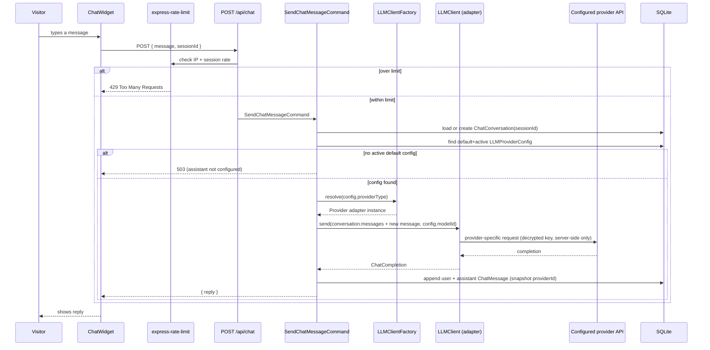
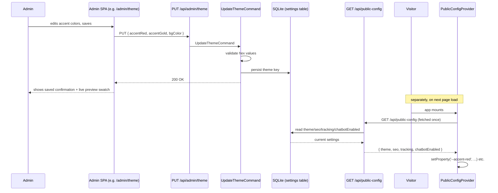

# Sequence flows

Cross-module flows that don't belong to a single module doc. The booking → conversion-tracking
flow is diagrammed in `marketing.md` (it's Marketing reacting to a Booking domain event); this doc
covers the other two flows that cross module boundaries: a visitor chat message, and an admin
config change reaching the public site.

## Visitor sends a chat message

Two guard rails visible directly in the diagram: the rate-limit check happens **before** any LLM
call (protects the BYOK key's spend, not just the server's CPU), and the "no active default
config" branch means an unconfigured assistant fails cleanly with a clear status instead of a
confusing error from a factory that can't resolve anything.

## Admin changes a setting → public site picks it up

The two halves of this diagram are intentionally separated by the `Note` — this is the documented
"load-time read, not a live push" behavior from `admin-settings.md`. A visitor with the site
already open in a tab won't see the new theme until they reload; that's a conscious scope
boundary, not a bug to silently work around with polling.

## Where each flow's detail lives

| Flow | Full detail |
| --- | --- |
| Booking submission → FB/TikTok conversion events | `marketing.md` |
| Chat message | above |
| Admin setting → public config | above |
| Admin CRUD (tracks/events/bookings/biolinks) | Unchanged from `project/uploads/CODING_AGENT_BRIEF.md` Stage 1 — standard REST CRUD, no new sequence needed |
